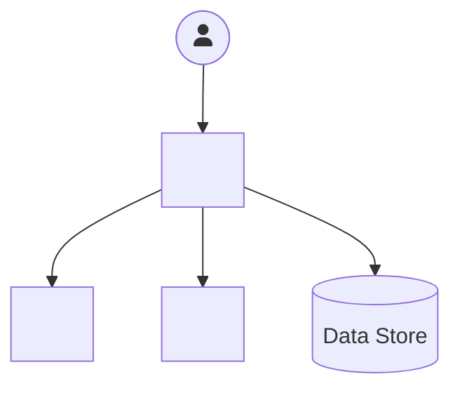
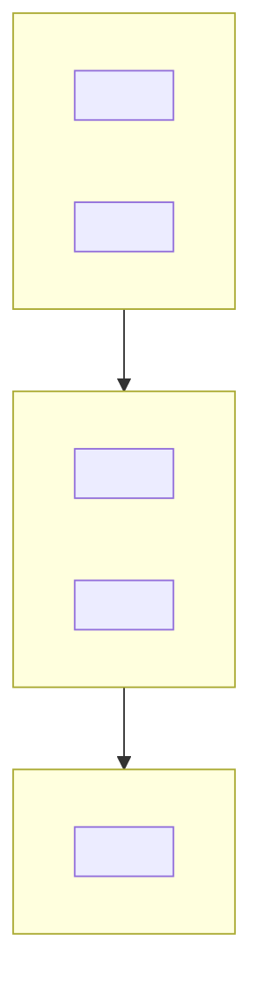
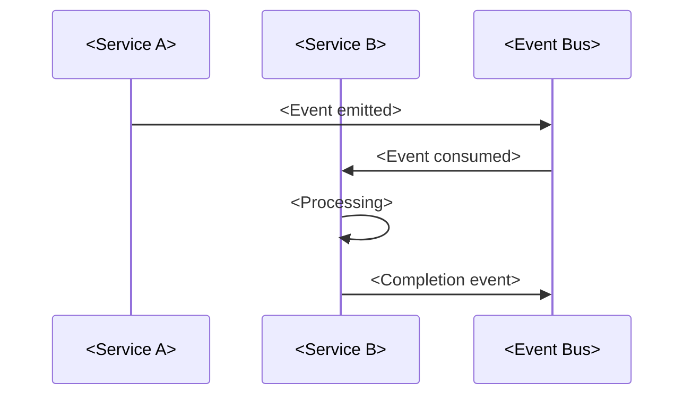
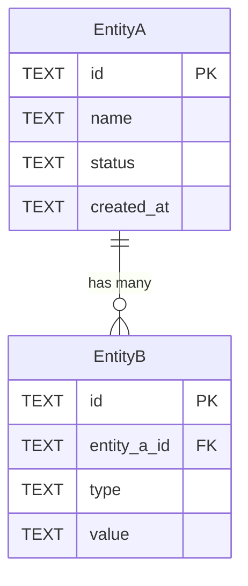
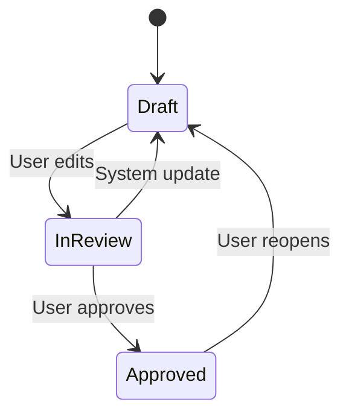
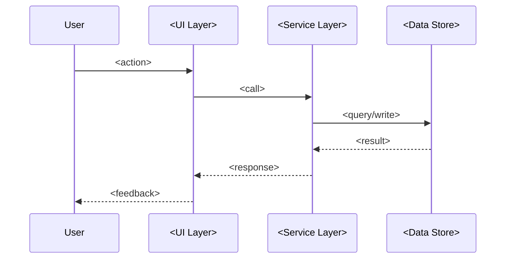

# Architecture Document Templates

This file defines two template variants. The PM selects HLD or LLD at runtime. Both can be combined into a single document when appropriate.

---

## Template A - High-Level Design (HLD)

Used for strategy-driven ground-up architectures and significant extensions. Focuses on system boundaries, service layering, data flow, and communication patterns. Leaves implementation details to follow-up LLD documents.

```markdown
# <System / Feature Name> - Architecture Document

## Document Control

| Version | Date | Author | Changes |
|---------|------|--------|---------|
| 1.0 | <date> | <author> | Initial draft |

**Status:** <Draft / In Review / Approved>
**Audience:** <Engineers, architects, technical leads, partner teams, leadership>
**Scope:** <HLD / LLD / Combined>

---

## 1. Executive Summary

<2-3 paragraphs. State what the system does, the business problem it solves, and the key architectural decisions. Ground in concrete outcomes - scale numbers, timeline targets, customer impact. Reference the source document (strategy doc, one-pager) that drives this architecture.>

---

## 2. Design Philosophy & Principles

| Principle | Rationale |
|-----------|-----------|
| **<Principle name>** | <Why this principle matters and what it constrains> |
| **<Principle name>** | <Rationale> |
| **<Principle name>** | <Rationale> |

<3-6 principles. Each should be opinionated and constrain design choices. "Offline-first", "Event-driven by default", "Tenant-level isolation" - not generic statements like "follow best practices".>

---

## 3. System Context

<Describe the system boundary and all external integrations. Who uses the system? What external services does it communicate with? What data flows in and out?>



**Key boundary decisions:** <What is inside vs outside the system? What deliberate exclusions were made and why?>

---

## 4. High-Level Architecture

<The primary architecture diagram showing major components, their relationships, and communication patterns. This is the diagram that should be explainable on a whiteboard in 5 minutes.>



<1-2 paragraphs explaining the layering rationale and primary communication flow.>

---

## 5. Key Architectural Concepts

<Define the domain-specific concepts that the architecture introduces. These are the building blocks that the rest of the system operates on. For each concept, define what it is, its lifecycle, and how it relates to other concepts.>

### 5.1 <Concept Name>

<Definition, characteristics, lifecycle, relationships to other concepts. Include examples.>

### 5.2 <Concept Name>

<Continue as needed.>

---

## 6. Service / Component Breakdown

<For each major service or component, describe its responsibility, dependencies, and APIs.>

### 6.1 <Service / Component Name>

| Aspect | Detail |
|--------|--------|
| **Responsibility** | <What this component owns> |
| **Depends on** | <Upstream services or data> |
| **Produces** | <Outputs, events, artifacts> |
| **Communication** | <Sync API / Event-driven / Both> |

<1-2 paragraphs on key design decisions for this component.>

### 6.2 <Service / Component Name>

<Continue for each component.>

---

## 7. Data Architecture

<Describe the data layer: what stores exist, what data lives where, and how data flows between stores.>

### 7.1 Data Store Inventory

| Store | Technology | Purpose | Data Classification |
|-------|-----------|---------|-------------------|
| <Name> | <Tech> | <What it stores> | <PII / Customer Content / System> |

### 7.2 Data Flow


<Explain data retention, consistency model, and any cross-store synchronization patterns.>

---

## 8. Communication Patterns

<How do services talk to each other? Define the primary patterns and when to use each.>

| Pattern | When to Use | Example |
|---------|-------------|---------|
| Synchronous API | <criteria> | <example interaction> |
| Event-driven | <criteria> | <example interaction> |
| Agent tool call | <criteria> | <example interaction> |



---

## 9. Security & Compliance

| Control | Implementation | Status |
|---------|---------------|--------|
| **<Security control>** | <How it is implemented> | <Mitigated / Planned / Known risk> |

<Include: authentication, authorization, data encryption (at rest, in transit), tenant isolation, compliance requirements, threat model if applicable.>

---

## 10. Alternatives Considered

| Alternative | Pros | Cons | Decision |
|-------------|------|------|----------|
| <Option A> | <advantages> | <disadvantages> | <Chosen / Rejected and why> |
| <Option B> | <advantages> | <disadvantages> | <Chosen / Rejected and why> |

<Every significant architectural decision should list at least one alternative that was considered and rejected, with clear reasoning.>

---

## 11. Risks & Open Questions

| # | Risk / Question | Severity | Owner | Status |
|---|----------------|----------|-------|--------|
| 1 | <description> | <High/Medium/Low> | <name> | <Open / Resolved> |

---

## 12. Execution Plan

| Phase | Focus | Key Deliverables | Timeline |
|-------|-------|-----------------|----------|
| **Phase 1** | <scope> | <what ships> | <target> |
| **Phase 2** | <scope> | <what ships> | <target> |

---

## Appendix

<Optional. Include: detailed API schemas, extended data models, glossary, reference links, related documents.>
```

---

## Template B - Low-Level Design (LLD)

Used for incremental feature architectures and spec-driven designs. Focuses on data models, API contracts, state machines, file structure, and implementation details. Assumes the HLD / system context already exists.

```markdown
# <Feature / Component Name> - Low-Level Design

## Document Control

| Version | Date | Author | Changes |
|---------|------|--------|---------|
| 1.0 | <date> | <author> | Initial draft |

**Status:** <Draft / In Review / Approved>
**Parent Architecture:** <Link to HLD or system architecture doc>

---

## 1. Overview

<1-2 paragraphs. What is being built, which part of the system it extends, and why. Reference the parent spec or one-pager that drives this work.>

---

## 2. Data Model

### 2.1 Entity-Relationship Diagram



### 2.2 Table / Schema Definitions

#### `<table_name>`

| Column | Type | Constraints | Description | Example |
|--------|------|-------------|-------------|---------|
| `id` | TEXT | PRIMARY KEY | Unique identifier | `"abc-123"` |

### 2.3 Indexing Strategy

| Index | Columns | Purpose |
|-------|---------|---------|
| <name> | <columns> | <query it optimizes> |

---

## 3. API Design

### 3.1 <API Endpoint / Operation>

| Aspect | Detail |
|--------|--------|
| **Method** | <GET / POST / PUT / DELETE> |
| **Path** | <endpoint path> |
| **Auth** | <authentication requirement> |
| **Request** | <request body schema> |
| **Response** | <response body schema> |
| **Errors** | <error codes and meanings> |

### 3.2 <API Endpoint / Operation>

<Continue for each API.>

---

## 4. State Management

### 4.1 State Machine



### 4.2 State Transitions

| From | To | Trigger | Side Effects |
|------|----|---------|-------------|
| Draft | InReview | User edits artifact | Lock from system updates |

---

## 5. Component Design

### 5.1 <Component / Module Name>

**Responsibility:** <what this component owns>

| Function / Method | Input | Output | Description |
|-------------------|-------|--------|-------------|
| `<name>` | <params> | <return> | <what it does> |

### 5.2 Interaction Flow



---

## 6. Error Handling

| Error Scenario | Detection | Recovery | User Impact |
|---------------|-----------|----------|-------------|
| <scenario> | <how detected> | <what happens> | <what user sees> |

---

## 7. Testing Strategy

| Level | Scope | Tooling | Coverage Target |
|-------|-------|---------|----------------|
| Unit | <what is unit tested> | <framework> | <target> |
| Integration | <what is integration tested> | <framework> | <target> |
| E2E | <what is end-to-end tested> | <framework> | <target> |

---

## 8. Migration / Rollout Plan

<How does this change get deployed? Any backward compatibility concerns? Feature flags? Data migrations?>

---

## 9. Tech Debt & Known Limitations

| Item | Severity | Description | Recommended Fix |
|------|----------|-------------|-----------------|
| <item> | <severity> | <what and why> | <proposed solution> |
```

---

## Diagram Type Reference

Use this reference to pick the right Mermaid diagram type for each architectural concept:

| Concept | Diagram Type | Mermaid Syntax |
|---------|-------------|---------------|
| System boundaries & external integrations | System context | `graph TD` |
| Service layering & component hierarchy | Layered architecture | `graph TD` with `subgraph` |
| Data flow & pipelines | Data flow | `graph LR` |
| Entity relationships & data model | ER diagram | `erDiagram` |
| Request/response flows & API interactions | Sequence diagram | `sequenceDiagram` |
| Lifecycle states & transitions | State machine | `stateDiagram-v2` |
| User journeys & navigation | User flow | `graph LR` or `graph TD` |
| Decision trees & branching logic | Flowchart | `graph TD` with diamond nodes |
| Timeline & phasing | Gantt chart | `gantt` |
| Class structure & type hierarchy | Class diagram | `classDiagram` |

---

## Architecture Document Checklist

Before finalizing, verify:

### Structure
- [ ] Document control table present with version, date, author
- [ ] Executive summary is concise and grounded in business context
- [ ] Design principles are opinionated and constraining (not generic)
- [ ] System context diagram shows all external boundaries
- [ ] At least one primary architecture diagram present

### Diagrams
- [ ] Every layer / service / data store appears in at least one Mermaid diagram
- [ ] Diagrams use consistent naming (same component name in text and diagram)
- [ ] Communication patterns (sync vs async) are visually distinct
- [ ] Data flow direction is clear (arrows labeled with what flows)

### Decisions
- [ ] Alternatives considered section has at least one rejected option per major decision
- [ ] Tradeoffs are stated explicitly (what you gain, what you give up)
- [ ] Risks and open questions have owners and severity

### Completeness (HLD)
- [ ] All services/components have defined responsibilities
- [ ] Communication patterns are specified (when sync, when async)
- [ ] Security controls are listed with implementation status
- [ ] Execution plan maps deliverables to phases

### Completeness (LLD)
- [ ] Data model has ER diagram and column-level schema definitions
- [ ] API contracts have method, path, request/response schemas
- [ ] State transitions are documented with triggers and side effects
- [ ] Error handling covers detection, recovery, and user impact
- [ ] Testing strategy specifies levels and tooling
- [ ] Tech debt is cataloged with severity and recommended fixes
