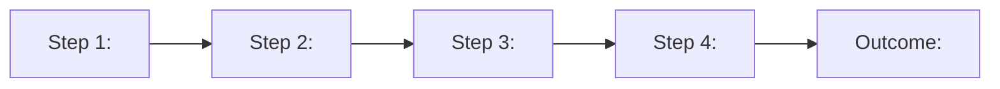

# <Feature/Capability Name>

## Document History

| Date | Type | Created by |
|------|------|------------|
| **<date>** | One Pager | <author name> |

## Review History

| Date | Reviewed by |
|------|-------------|
| **<date>** | <reviewer names> |

---

## Introduction

<2-3 sentences framing the problem with a specific metric or timeline. Lead with the cost of inaction or the size of the opportunity. No generic industry overview.>

## Problem: <Bold summary of the core issue>

<Brief context paragraph connecting the problem to the product and customer journey.>

1. **<Pain point title>:** <Description with data evidence. Reference customer feedback, survey results, or telemetry. Explain what happens today and why it fails.>

2. **<Pain point title>:** <Description with data. Include competitive context where relevant - "your cloud platform scored lower than AWS/GCP on ease of X in a recent survey.">

3. **<Pain point title>:** <Description with data. Connect to business impact - time lost, cost overruns, customer churn risk.>

### Real-World Examples

<Named customer cases with specific timelines. Format:>

- **<Company Name>**: <Context, process timeline, outcome, pain points. Include specific month counts or cost figures.>
- **<Company Name>**: <Same format. The more specific, the more persuasive.>

## Approach: <Bold summary of the solution direction>

<Brief paragraph connecting the solution to the product strategy. Explain why this approach was chosen over alternatives.>

1. **<Principle/capability title>:** <What it does and why it matters. Reference which pain points it addresses. Include competitive positioning if relevant - "This matches or exceeds what AWS provides with X.">

2. **<Principle/capability title>:** <Same format. Each principle should map to at least one pain point above.>

3. **<Principle/capability title>:** <Same format.>

4. **<Principle/capability title>:** <Same format. Include technical approach at a high level - enough for engineering partners to understand feasibility.>

## User Scenarios

<Brief intro: "The following scenarios describe the capabilities this solution will deliver, organized by migration phase and priority.">

| # | Phase | User Scenario | Priority / Sequencing |
|---|-------|--------------|----------------------|
| 1 | **Decide** | **"I can <action> so that <benefit>."** <Brief rationale for why this matters.> | **Crawl (P0):** <scope details - data sources, mechanisms, constraints> |
| | | | **Walk (P1):** <expanded scope> |
| | | | **Run (P2):** <full vision scope> |
| 2 | **Plan** | **"I can <action> so that <benefit>."** <Rationale.> | **Crawl (P0):** <scope> |
| | | | **Walk (P1):** <scope> |
| 3 | **Execute** | **"I can <action> so that <benefit>."** <Rationale.> | **Crawl (P0):** <scope> |
| | | | **Walk (P1):** <scope> |

## Workflow

<Brief description of what the diagram shows.>

## Phasing Summary

| Phase | Focus | Target Scenarios | ETA |
|-------|-------|-----------------|-----|
| **Crawl (P0)** | <MVP focus and constraints> | Scenarios 1, 2 | <timeframe> |
| **Walk (P1)** | <expansion focus> | Scenarios 3, 4 | <timeframe> |
| **Run (P2)** | <full vision> | Scenarios 5+ | <timeframe> |

**Note:** <Any caveats about ETAs, dependencies, or confidence levels.>

---

## Appendix

### Competition Analysis

| Capability | your cloud platform (Proposed) | AWS | GCP |
|-----------|-----------------|-----|-----|
| <capability> | <what we will do> | <what they do> | <what they do> |
| <capability> | <proposed> | <current> | <current> |

### Customer Stories

#### <Company Name>

- **Issue:** <What problem they faced>
- **What we learned:** <Key takeaways from their experience>
- **Action plan:** <How our solution addresses their needs>

### References

- [<Document title>](<link>) - <Brief description of what this reference contains>
- [<Document title>](<link>) - <Brief description>
