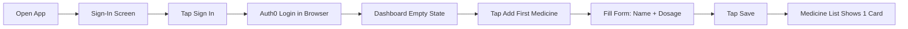

# Spec Example  - Medicine Tracker (Curated Excerpt)

This excerpt from a real spec shows the expected quality, depth, and formatting. Use it as a reference for tone, specificity of acceptance criteria, and persona detail.

---

## Problem Statement (Example)

Managing multiple prescriptions for a family is complex and error-prone. People forget doses, run out of medicines unexpectedly, and lose track of which family member takes what. Existing solutions fall into three unsatisfying categories:

1. **Hospital-grade systems**  - too complex, designed for clinical staff, not families.
2. **Basic reminder apps**  - only send alarms, with no inventory tracking or medicine detail management.
3. **Cloud-dependent apps**  - require accounts and servers, raising privacy concerns about sensitive health data.

There is a gap for a simple, private, family-friendly medicine manager that works entirely on-device.

---

## Persona (Example)

### Priya  - Primary Persona

| Attribute | Detail |
|-----------|--------|
| **Age** | 35 |
| **Role** | Working mother |
| **Tech comfort** | Moderate, uses smartphone daily, comfortable with apps |
| **Pain points** | Forgets her own evening dose due to busy work schedule. Runs out of her mother's BP meds because nobody tracks the bottle count. Confused about which family member takes what. |
| **Goals** | One app per family member. Quick daily check: "What do I need to take today?" Push notifications so she doesn't have to remember. Low-stock warnings before the bottle runs empty. |
| **Quote** | "I just need something that reminds me AND tells me when to refill." |

---

## Feature Specification (Example)

### F5: OCR Prescription Scanning (Phase 5)

**Description:** Use the device camera or photo library to photograph a prescription label. Send the image to Claude API (claude-haiku-4-5) which extracts medicine name, dosage, instructions, and doctor. Pre-fill the add-medicine form with the extracted data. The user always reviews before saving.

**User Stories:**
- As a user, I can tap "Scan Prescription Label" on the add-medicine screen to open the camera.
- As a user, I can choose to take a new photo or select an existing one from my photo library.
- As a user, I see the extracted fields pre-filled in the form and can correct any errors before saving.

**Acceptance Criteria:**
- [ ] Camera permission is requested with a clear, user-friendly explanation message.
- [ ] Image is sent as base64 to the Claude API endpoint.
- [ ] API response is parsed into `AddMedicineInput` fields: `name`, `dosage`, `instructions`, `doctor`.
- [ ] Extracted fields pre-fill the form, and the user reviews and edits before tapping Save.
- [ ] OCR never auto-saves; the user must explicitly confirm.
- [ ] Network errors show: "Could not connect. Check your internet and try again."
- [ ] API errors show: "Could not read the label. Try a clearer photo or enter details manually."
- [ ] Loading state shows a spinner with "Scanning prescription..." text.

**Why this is good:**
- Each criterion is specific and testable (a developer knows exactly what to build)
- Error states are enumerated with exact copy
- The "never auto-save" criterion makes the boundary between system and user action explicit
- No vague words: no "should", "might", "fast", "appropriate"

---

## Risk Register (Example)

| ID | Risk | Impact | Probability | Mitigation |
|----|------|--------|-------------|------------|
| R1 | API key exposed in app binary | High (abuse, billing) | Medium | Use backend proxy before production. Acceptable for dev/learning. |
| R3 | OCR misreads prescription fields | Medium (wrong medicine added) | High | Always require user review before save. Never auto-save from OCR results. |
| R4 | SQLite data lost on app uninstall | High (all history gone) | Certain (by OS design) | Document limitation clearly. Future: add export/backup feature. |

**Why this is good:**
- Risks are specific, not generic ("API key exposed" not "security risk")
- Impact and probability are both rated
- Mitigations are concrete actions, not "handle later"
- Mix of technical and product risks

---

## NFR Example

### Performance

| Metric | Target |
|--------|--------|
| Cold start to interactive | Under 3 seconds |
| Medicine list render (up to 50 medicines) | Under 500ms |
| SQLite query latency | Under 10ms |

**Why this is good:** Every metric has a quantified target. No "fast" or "responsive".

---

## User Journey (Example)

### First-Time Setup

**Estimated time:** Under 2 minutes from install to first medicine saved.
