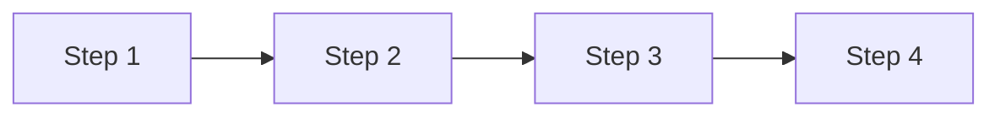

# Spec Template - 13-Section Structure

Generate the spec using this exact structure. Fill every section with substantive content. Do not skip or reorder sections.

---

```markdown
# <Feature Name> - Product Specification

| Field | Value |
|---|---|
| **PM Author** | [Name] |
| **PM Reviewer** | [Name] |
| **Engineering Reviewer** | [Name] |
| **UX Reviewer** | [Name] |
| **Date Created** | [Month Year] |
| **Date Last Updated** | [Month Year] |
| **Document Status** | Draft v0.1 |
| **Audience** | Engineering, UX, Program Management |

---

## Table of Contents

1. [Overview](#1-overview)
2. [Business Requirement](#2-business-requirement)
3. [Problem](#3-problem)
4. [I Can Statements](#4-i-can-statements)
5. [Solution](#5-solution)
6. [Experience](#6-experience)
7. [Telemetry](#7-telemetry)
8. [Acceptance Criteria](#8-acceptance-criteria)
9. [Risk Register](#9-risk-register)
10. [Open Questions](#10-open-questions)
11. [Glossary](#11-glossary)

---

## 1. Overview

<Establish the current state (what exists today). State the gap or limitation that this feature addresses. Do NOT describe the solution here. End with a one-sentence statement of what this specification introduces and its purpose, not how it works.>

---

## 2. Business Requirement

### 2.1 Customer Need

<Who needs this, why, and what they need the product to do. Use a numbered list of concrete needs.>

1. <Need 1>
2. <Need 2>
3. <Need 3>

### 2.2 Business Impact

- <Measurable or qualifiable benefit 1>
- <Measurable or qualifiable benefit 2>
- <Measurable or qualifiable benefit 3>

### 2.3 Competitive Landscape

<Brief comparison of how competitors or industry tools handle this problem. Only include if PM confirmed during research step. Omit this sub-section if not applicable.>

---

## 3. Problem

### 3.1 <Problem Name>

<State the problem, then its consequence. Do not describe the solution. Be specific: cite what happens today, what the user experiences, and what goes wrong.>

### 3.2 <Problem Name>

<Each distinct problem gets its own numbered sub-section.>

---

## 4. I Can Statements

| "I Can" Statement | Persona | Priority |
|---|---|---|
| As a <persona>, I can <specific action> without <current pain> | <Persona> | P0 |
| As a <persona>, I can programmatically <action> via the API for <purpose> | <Persona> | P0 |
| As a <persona>, I can <action> so that <benefit> | <Persona> | P1 |

Priority key: P0 = must-have for launch. P1 = high-value, ship shortly after. P2 = future phase.

Each feature needs at least 2 "I Can" statements covering different personas where applicable.

---

## 5. Solution

### 5.1 Technical Approach

<Detection logic, classification rules, pipeline changes, routing and computation changes: what gets computed, what gets skipped.>

### 5.2 Data Model

<Tables for classification rules, field mappings, configuration options. JSON schemas or data model definitions for new or changed entities.>

```json
{
  "example_schema": {
    "field_name": "type - description"
  }
}
```

<This is the technical "how". Keep it free from restated problem context.>

---

## 6. Experience

### 6.1 Portal

<Assessment creation flow, report/insights views, detail views, listings, any new blades or panels.>

**User Journey:**
- What the user sees (banner text, insight card copy, grid columns)
- What happens when the user clicks/interacts
- What information is displayed and how



### 6.2 API Surface

<New fields, new endpoints, filter parameters, response schemas.>

```json
{
  "example_response": {}
}
```

### 6.3 Agentic Workflow

<How the AI chat surfaces this feature in responses. Include example conversation exchanges.>

**Scenario: <Name>**

> User: "<example query>"
>
> Assistant: "<expected response including feature-specific callout>"

**Scenario: <Name>**

> User: "<example query>"
>
> Assistant: "<expected response>"

### 6.4 Export

<Excel/CSV export column mappings, highlights section key-value pairs.>

| Export Column | Source Field | Notes |
|---|---|---|
| <Column> | <Field> | <Notes> |

---

## 7. Telemetry

### 7.1 Telemetry Events

| Event Name | Description | Key Properties |
|---|---|---|
| `event_name_snake_case` | When this fires | `property_1`, `property_2` |
| `event_name_snake_case` | When this fires | `property_1`, `property_2` |

### 7.2 Key Success Metrics

| Metric | Definition | Target (N months post-launch) |
|---|---|---|
| <Metric name> | How it is measured | Numeric target with >= or <= |
| <Metric name> | How it is measured | Numeric target with >= or <= |

---

## 8. Acceptance Criteria

### AC-1: <Descriptive Title>

**Description:** <Plain-language description of what must be true.>

**Pass criterion:** <Specific, testable condition.>

### AC-2: <Descriptive Title>

**Description:** <Plain-language description of what must be true.>

**Pass criterion:** <Specific, testable condition.>

<Each criterion gets a unique ID (AC-1, AC-2, ...). Cover: detection accuracy, data integrity, portal behavior, API behavior, export behavior, agentic behavior. Every "I Can" statement must have at least one corresponding acceptance criterion.>

---

## 9. Risk Register

| Risk ID | Risk Description | Probability | Impact | Mitigation |
|---|---|---|---|---|
| R-1 | <Risk text> | Low / Medium / High | Low / Medium / High | <Concrete mitigation strategy> |
| R-2 | <Risk text> | Low / Medium / High | Low / Medium / High | <Concrete mitigation strategy> |
| R-3 | <Risk text> | Low / Medium / High | Low / Medium / High | <Concrete mitigation strategy> |

At least 3 risks. Cover both technical risks (API failures, data loss, security) and product risks (adoption, usability, scope creep).

---

## 10. Open Questions

| # | Question | Owner | Resolution Date |
|---|---|---|---|
| OQ-1 | <Question text> | <Owner team> | TBD |
| OQ-2 | <Question text> | <Owner team> | TBD |

---

## 11. Glossary

| Term | Definition |
|---|---|
| <Term> | <Plain-language definition> |
| <Term> | <Plain-language definition> |
```
